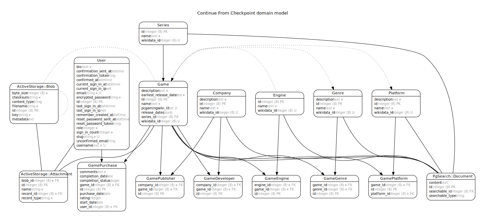

# VideoGameList (VGList)

[](https://gitlab.com/connorshea/videogamelist/commits/master)
[](https://gitlab.com/connorshea/videogamelist/commits/master)

This is a Rails application for tracking your video game library.

## Getting set up

### Prerequisites

- Ruby 2.6
- Postgres 11.x
- A recent version of Node.js
- Yarn 1.x
- ImageMagick (for images, like avatars or game covers)

### Setup instructions

1. Clone the repository with git
1. To get Bundler 2.0.1, `gem install bundler:2.0.1`
1. `bundle install`
1. `yarn install`
1. `bin/rails db:setup`
   - This is the equivalent of running `bin/rails db:create && bin/rails db:schema:load && bin/rails db:seed`, so it will create the databases, seed them with fake data, and create a user with the email `admin@example.com` and the password `password`.
   - If you would like more control, run only `bin/rails db:create` and `bin/rails db:schema:load`.
1. `bin/rails server` to start the server.
1. Visit <http://localhost:3000> in your browser and you should see the base application.
1. In a separate terminal window, run `bin/webpack-dev-server` alongside the Rails server to have a webpack-dev-server instance.
   - You don't _have_ to do this for the site to work, but things will take a lot longer to load as webpack has to compile stuff from within the same process as Rails.

#### Extras

- If you want to test the Steam import functionality, you'll need to [generate a Steam Web API Key](https://steamcommunity.com/dev/registerkey) and set it as an environment variable, `STEAM_WEB_API_KEY`.

### Running in production locally with Docker

If you want to use Docker to test the application locally in production mode, you can do so by following these instructions:

- Make sure you have Docker and Docker Compose installed, as well as Postgres.
- Create a file called `prod.env` that passes environment variables into your container. It'll look something like this:

```env
SECRET_KEY_BASE=dumb
DATABASE_URL=postgres://postgres@db
DATABASE_PASSWORD=productionpassword
```

- Run `docker-compose up --build`.
- In another terminal window, run `docker-compose exec web bundle exec rails db:create` and then `docker-compose exec web bundle exec rails db:migrate`.
- You may also want to run `docker-compose exec --env DATABASE_CLEANER_ALLOW_REMOTE_DATABASE_URL=true DATABASE_CLEANER_ALLOW_PRODUCTION=true web bundle exec rails db:seed` to get some data in the database (the environment variables are necessary because the remote database and production environment trip database_cleaner's safeguards). Note: **NEVER RUN THIS COMMAND IN PRODUCTION FOR REAL**

Docker isn't currently used for development, you can just run the application "natively" as described in the previous section.

### GitLab CI

To update the Docker container used by GitLab CI:

- Log into the GitLab CI Docker registry with `docker login registry.gitlab.com`.
- Build the container with `docker build -f Dockerfile.ci -t registry.gitlab.com/connorshea/videogamelist .`
- Then use `docker push registry.gitlab.com/connorshea/videogamelist` to push the container to the GitLab Container Registry.

## Design Document

See [DESIGN_DOC.md](DESIGN_DOC.md) for the general design plan for this project.

## App Structure Visualization



Generated by [rails-erd](https://github.com/voormedia/rails-erd).
